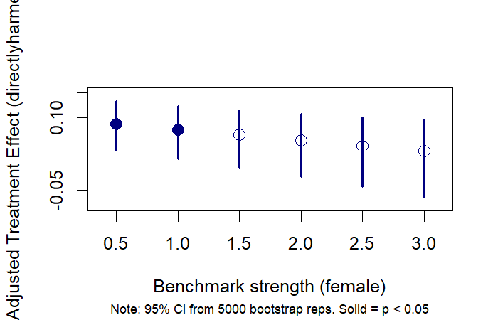
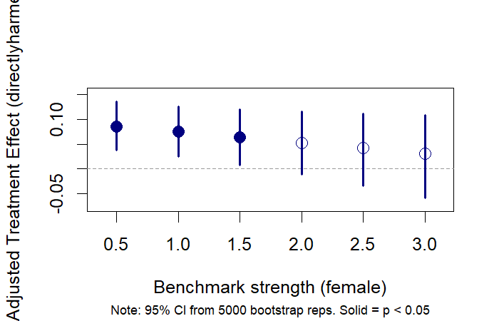
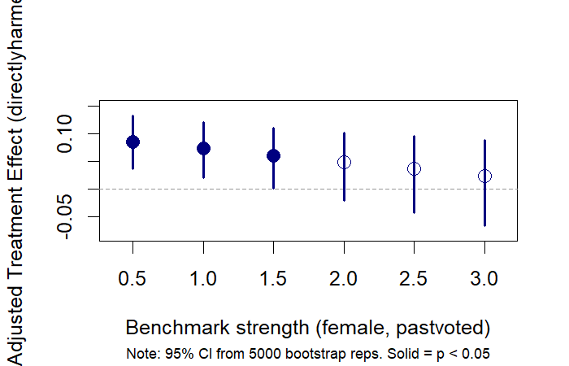
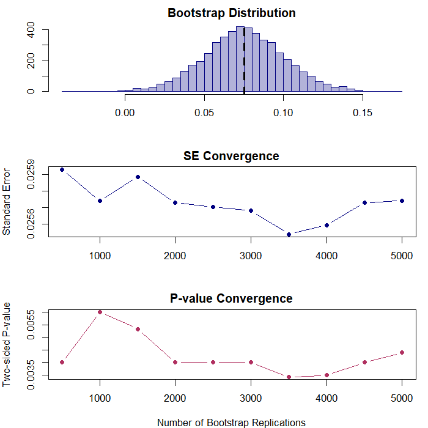

# bootmakr

<!-- badges: start -->

[](https://github.com/)
[](https://opensource.org/licenses/MIT)
<!-- badges: end -->

**Bootstrap inference for sensitivity analysis under omitted variable
bias.**

`bootmakr` wraps the
[sensemakr](https://github.com/carloscinelli/sensemakr) package in a
bootstrap loop, producing bootstrap standard errors, percentile
confidence intervals, and *p*-values for the bias-adjusted treatment
effect. It is the companion R package to the Stata command of the same
name.

## Why bootstrap the sensitivity bounds?

`sensemakr` computes analytical adjusted estimates and confidence
intervals under a hypothetical confounder with a given strength. These
analytical intervals rely on asymptotic OLS standard errors, which may
not perform well with clustered data, small samples, or complex survey
designs. `bootmakr` replaces the analytical inference with a
nonparametric bootstrap — including cluster and stratified bootstrap —
so the CIs and *p*-values are robust to these complications.

## Installation

``` r
# Install from GitHub (once published):
# devtools::install_github("username/bootmakr")
```

## Quick start

We use the Darfur data from `sensemakr`, with the full model
specification including village fixed effects and `female` as the
benchmark covariate:

``` r
library(bootmakr)

data(darfur, package = "sensemakr")

out <- bootmakr(
  peacefactor ~ directlyharmed + age + farmer_dar + herder_dar +
    pastvoted + hhsize_darfur + female + village,
  data    = darfur,
  treat   = "directlyharmed",
  benchmark_covariates = "female",
  kd      = 1,
  reps    = 5000,
  seed    = 42
)
out
```

    #> Bootstrapping (5,000 reps)
    #> |==================================================| 100%
    #>
    #> Bootstrap sensitivity analysis (5,000 reps, n = 1,276)
    #> Benchmark: female | kd = 1, ky = 1
    #>
    #> Adjusted estimates (percentile 95% CI):
    #>                Estimate Std. Err     2.5%    97.5% Pr(>|0|)
    #> directlyharmed 0.075220 0.027206 0.014938 0.122953   0.0112 *
    #> ---
    #> Signif. codes:  0 '***' 0.001 '**' 0.01 '*' 0.05 '.' 0.1 ' ' 1
    #> (H0: adjusted estimate = 0; CI and p-value from percentile bootstrap)

## Sweeping across benchmark strengths

Supply a vector of `kd` values to see how the adjusted effect changes as
the hypothetical confounder grows stronger. The `plot()` method produces
a coefficient plot with bootstrap CIs. Here the simple (non-clustered)
bootstrap accounts for heteroskedasticity induced by the village fixed
effects:

``` r
out_sweep <- bootmakr(
  peacefactor ~ directlyharmed + age + farmer_dar + herder_dar +
    pastvoted + hhsize_darfur + female + village,
  data    = darfur,
  treat   = "directlyharmed",
  benchmark_covariates = "female",
  kd      = seq(0.5, 3, by = 0.5),
  reps    = 5000,
  seed    = 42
)
out_sweep
plot(out_sweep, type = "kd_sweep")
```

    #> Bootstrap sensitivity analysis (5,000 reps, n = 1,276)
    #> Benchmark: female | kd = 0.5 1 1.5 2 2.5 3, ky = 0.5 1 1.5 2 2.5 3
    #>
    #> Adjusted estimates (percentile 95% CI):
    #>                         Estimate Std. Err      2.5%    97.5% Pr(>|0|)
    #> directlyharmed (kd=0.5) 0.086294 0.025604  0.031655 0.132553   0.0016 **
    #> directlyharmed (kd=1)   0.075220 0.027206  0.014938 0.122953   0.0112  *
    #> directlyharmed (kd=1.5) 0.064094 0.029564 -0.002553 0.113414    0.058  .
    #> directlyharmed (kd=2)   0.052915 0.032561 -0.022221 0.106317    0.173
    #> directlyharmed (kd=2.5) 0.041683 0.036082 -0.041974 0.100148    0.364
    #> directlyharmed (kd=3)   0.030396 0.040035 -0.063738 0.094930    0.616



## Cluster bootstrap

If observations are correlated within villages, pass
`cluster = "village"` for a cluster-robust bootstrap — the resampling is
done at the village level:

``` r
out_cl <- bootmakr(
  peacefactor ~ directlyharmed + age + farmer_dar + herder_dar +
    pastvoted + hhsize_darfur + female + village,
  data    = darfur,
  treat   = "directlyharmed",
  benchmark_covariates = "female",
  kd      = seq(0.5, 3, by = 0.5),
  reps    = 5000,
  seed    = 42,
  cluster = "village"
)
out_cl
plot(out_cl, type = "kd_sweep")
```

    #> Bootstrap sensitivity analysis (5,000 reps, n = 1,276, 486 clusters)
    #> Benchmark: female | kd = 0.5 1 1.5 2 2.5 3, ky = 0.5 1 1.5 2 2.5 3
    #>
    #> Adjusted estimates (percentile 95% CI):
    #>                         Estimate Std. Err      2.5%    97.5% Pr(>|0|)
    #> directlyharmed (kd=0.5) 0.086294 0.024201  0.038727 0.135706    8e-04 ***
    #> directlyharmed (kd=1)   0.075220 0.025742  0.024539 0.126549   0.0044  **
    #> directlyharmed (kd=1.5) 0.064094 0.028536  0.007804 0.120179   0.0312   *
    #> directlyharmed (kd=2)   0.052915 0.032326 -0.011627 0.115624    0.112
    #> directlyharmed (kd=2.5) 0.041683 0.036870 -0.033500 0.111910    0.262
    #> directlyharmed (kd=3)   0.030396 0.041984 -0.058243 0.108181    0.456



## Grouped benchmarks

When the benchmark for the hypothetical confounder should reflect the
*joint* explanatory power of several covariates, use
`gbenchmark_covariates`. Internally this computes the group partial R²
(via `sensemakr::group_partial_r2`) and applies the proper nonlinear
kd-scaling:

``` r
out_g <- bootmakr(
  peacefactor ~ directlyharmed + age + farmer_dar + herder_dar +
    pastvoted + hhsize_darfur + female + village,
  data    = darfur,
  treat   = "directlyharmed",
  gbenchmark_covariates = c("female", "pastvoted"),
  kd      = seq(0.5, 3, by = 0.5),
  reps    = 5000,
  seed    = 42,
  cluster = "village"
)
out_g
plot(out_g, type = "kd_sweep")
```

    #> Bootstrap sensitivity analysis (5,000 reps, n = 1,276, 486 clusters)
    #> Benchmark: female, pastvoted | kd = 0.5 1 1.5 2 2.5 3, ky = 0.5 1 1.5 2 2.5 3
    #>
    #> Adjusted estimates (percentile 95% CI):
    #>                         Estimate Std. Err      2.5%    97.5% Pr(>|0|)
    #> directlyharmed (kd=0.5) 0.085241 0.024102  0.036624 0.132391   0.0016 **
    #> directlyharmed (kd=1)   0.073102 0.025333  0.020399 0.120879   0.0064 **
    #> directlyharmed (kd=1.5) 0.060900 0.027677  0.001730 0.110959   0.0448  *
    #> directlyharmed (kd=2)   0.048633 0.030954 -0.020264 0.102212    0.158
    #> directlyharmed (kd=2.5) 0.036301 0.034971 -0.042703 0.095262    0.368
    #> directlyharmed (kd=3)   0.023903 0.039569 -0.066144 0.089045    0.629



## Convergence diagnostics

Large-sample bootstrap inference depends on using enough replications.
Pass `converge = TRUE` (or a list with fine-grained control) to assess
whether SEs and *p*-values have stabilised:

``` r
out_conv <- bootmakr(
  peacefactor ~ directlyharmed + age + farmer_dar + herder_dar +
    pastvoted + hhsize_darfur + female + village,
  data    = darfur,
  treat   = "directlyharmed",
  benchmark_covariates = "female",
  kd      = 1,
  reps    = 5000,
  seed    = 42,
  cluster = "village",
  converge = list(minreps = 500, stepsize = 500, threshold = 3000)
)
out_conv
plot(out_conv, type = "convergence")
```

    #> Bootstrap sensitivity analysis (5,000 reps, n = 1,276, 486 clusters)
    #> Benchmark: female | kd = 1, ky = 1
    #>
    #> Adjusted estimates (percentile 95% CI):
    #>                Estimate Std. Err     2.5%    97.5% Pr(>|0|)
    #> directlyharmed 0.075220 0.025742 0.024539 0.126549   0.0044 **
    #> ---
    #> Signif. codes:  0 '***' 0.001 '**' 0.01 '*' 0.05 '.' 0.1 ' ' 1
    #>
    #> Convergence diagnostics (reps 500 to 5000 by 500, threshold = 3000):
    #>              Mean  Range  CV % Range (>=3000) CV% (>=3000)
    #> Std. error 0.0257 0.0004  0.46         0.0002         0.34
    #> P-value    0.0043 0.0026 18.83         0.0010        10.40



## Accessing the raw bootstrap draws

All bootstrap replicates are stored in the returned object, so there is
no need to re-run the analysis to inspect the distribution:

``` r
draws <- out_cl$boot_samples[, 1]
draws <- draws[is.finite(draws)]

quantile(draws, c(0.025, 0.5, 0.975))
```

    #>       2.5%        50%      97.5%
    #> 0.03872706 0.08592536 0.13570596

``` r
# Or export for further analysis
# write.csv(data.frame(adjusted_estimate = draws), "boot_draws.csv")
```

## Key arguments

| Argument | Description |
|----|----|
| `formula`, `data`, `treat` | Standard OLS specification and treatment name |
| `benchmark_covariates` | Individual benchmark covariate(s) |
| `gbenchmark_covariates` | Grouped benchmark covariates (joint partial R²) |
| `kd`, `ky` | Benchmark strength multipliers (`ky` defaults to `kd`) |
| `reps`, `seed` | Number of bootstrap replications and random seed |
| `cluster`, `strata` | Cluster and/or strata identifiers |
| `alpha` | Significance level (default 0.05) |
| `converge` | `TRUE`, `FALSE`, or `list(minreps, stepsize, threshold)` |
| `progress` | Show a progress bar (default `TRUE`) |

## Methods

| Method | Description |
|----|----|
| `print(x)` | Coefficient table with bootstrap SEs, CIs, and *p*-values |
| `plot(x, type = "kd_sweep")` | Coefficient plot across kd values |
| `plot(x, type = "histogram")` | Bootstrap distribution histogram |
| `plot(x, type = "convergence")` | Three-panel convergence diagnostic plot |
| `plot(x)` | Auto-selects the most informative plot |

## References

Cinelli, C. and Hazlett, C. (2020). Making Sense of Sensitivity:
Extending Omitted Variable Bias. *Journal of the Royal Statistical
Society, Series B (Statistical Methodology)*, 82(1), 39–67.

Cinelli, C., J. Ferwerda, and C. Hazlett (2024). sensemakr: Sensitivity
analysis tools for OLS in R and Stata. *Observational Studies*, 10(2),
93–127.

Lonati, S. and J. N. Wulff (2026). Why you should not use the ITCV with
robust standard errors (and what to do instead). *SSRN Working Paper*.

## License

MIT
