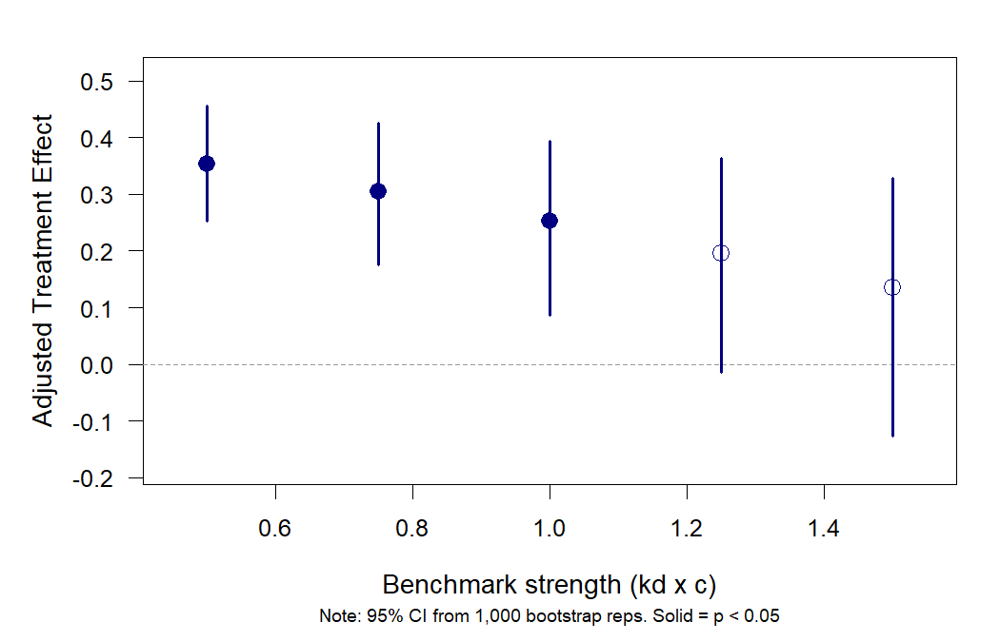

# bootmakr

<!-- badges: start -->

[](https://github.com/jespernwulff/bootmakr/actions/workflows/R-CMD-check.yaml)
[](https://opensource.org/licenses/MIT)
<!-- badges: end -->

**Bootstrap inference for sensitivity analysis to omitted variables.**

**Documentation, a getting-started guide, a worked example and the
argument behind the package, in R and Stata:
<https://jespernwulff.github.io/bootmakr/>**

`bootmakr` wraps [sensemakr](https://carloscinelli.com/sensemakr/)
(Cinelli & Hazlett, 2020) in a bootstrap loop. For an omitted variable
as strong as an observed benchmark covariate, it computes the
bias-adjusted coefficient and obtains its standard error, percentile
confidence interval and *p*-value by resampling observations, whole
clusters or units within strata. It is the companion R package to Lonati
and Wulff (2026) and to the [Stata command of the same
name](https://github.com/jespernwulff/bootmakr-stata).

## Why bootstrap?

The impact threshold of a confounding variable (ITCV) is read as the
product of correlations an omitted variable needs to overturn a result.
Lonati and Wulff (2026) show that this reading breaks down when the
regression is estimated with heteroskedasticity- or cluster-robust
standard errors, and that the analytic confidence interval of
`sensemakr` breaks down for the same reason. The remedy is the bootstrap
that Cinelli, Ferwerda and Hazlett (2024, Appendix C) propose: resample
the data the way you would choose standard errors, refit the regression
and recompute the adjusted estimate in every replication. `bootmakr`
automates it, and reports how strong the assumed omitted variable is on
the scale of the ITCV. See [Why
bootstrap?](https://jespernwulff.github.io/bootmakr/articles/why-bootstrap.html).

## Installation

``` r
# install.packages("remotes")
remotes::install_github("jespernwulff/bootmakr")
```

## Quick start

The package comes with `firms`, a simulated panel of 250 firms observed
for 20 years. The true effect of `x` on `y` is 0.25. An unobserved
firm-level variable `q`, as strong as the observed control `c`, biases
the regression that omits it; the within-firm components of `x` and of
the disturbance are persistent, so standard errors must be clustered by
firm. Here is what the coefficient of `x` would be had a variable as
strong as `c` been omitted, with firms resampled as whole clusters:

``` r
library(bootmakr)
data("firms")

out <- bootmakr(y ~ x + c, data = firms, treat = "x",
                benchmark_covariates = "c", cluster = "firm",
                reps = 1000, seed = 123, progress = FALSE)
out
#> 
#> Call:
#> bootmakr(formula = y ~ x + c, data = firms, treat = "x", benchmark_covariates = "c", 
#>     reps = 1000, seed = 123, cluster = "firm", progress = FALSE)
#> 
#> Bootstrap sensitivity analysis (1,000 reps, n = 5,000, 250 clusters)
#> Benchmark: c | kd = 1, ky = 1
#> 
#> Adjusted estimates (percentile 95% CI):
#>   Estimate Std. Err     2.5%    97.5% Pr(>|0|)  
#> x 0.252134 0.076236 0.087365 0.394215     0.01 *
#> ---
#> Signif. codes:  0 '***' 0.001 '**' 0.01 '*' 0.05 '.' 0.1 ' ' 1
#> (H0: adjusted estimate = 0; CI and p-value from percentile bootstrap)
#> 
#> Benchmark strength (descriptive: computed from the data, no standard errors involved)
#>                       Partial R2 |Partial r|
#> c with treatment | X      0.1433       0.379
#> c with outcome | D, X     0.1248       0.353
#> Implied strength of the omitted variable (sensemakr bounds):
#>           kd   ky R2dz.x R2yz.dx Impact
#> 1.00x c 1.00 1.00 0.1673  0.1998  0.222
#> (R2dz.x, R2yz.dx: partial R2 of the omitted variable with the treatment given the
#>  covariates, and with the outcome given treatment and covariates. Impact: product of
#>  its partial correlations with the outcome and with the treatment, both given the
#>  covariates only, i.e. the scale of the ITCV; signed so that the omitted variable
#>  biases the estimate away from zero. Descriptive only: independent of the variance
#>  estimator, and not a threshold.)
```

The adjusted estimate is close to the true 0.25, and its bootstrap
interval excludes zero. The block below the table says how strong “as
strong as `c`” is: as partial R² values and as the *impact*, the product
of the omitted variable’s partial correlations with the outcome and with
the treatment, which is the scale of the ITCV.

Several strengths at once show where the result breaks down:

``` r
sweep <- bootmakr(y ~ x + c, data = firms, treat = "x",
                  benchmark_covariates = "c", kd = seq(0.5, 1.5, by = 0.25),
                  cluster = "firm", reps = 1000, seed = 123, progress = FALSE)
sweep$results[, c("kd", "estimate", "se", "ci_lower", "ci_upper", "pvalue", "impact")]
#>     kd  estimate         se    ci_lower  ci_upper pvalue    impact
#> 1 0.50 0.3540423 0.05247928  0.25345109 0.4561464  0.000 0.1134982
#> 2 0.75 0.3046965 0.06280549  0.17641581 0.4250691  0.000 0.1682740
#> 3 1.00 0.2521337 0.07623598  0.08736489 0.3942151  0.010 0.2216809
#> 4 1.25 0.1959030 0.09332121 -0.01357331 0.3637976  0.066 0.2736747
#> 5 1.50 0.1354581 0.11503646 -0.12665311 0.3281231  0.276 0.3242071
plot(sweep, type = "kd_sweep")
```

<!-- -->

Because the data are simulated, every answer can be checked against the
regression that includes `q`:

``` r
coef(summary(lm(y ~ x + c + q, data = firms)))["x", 1:2]
#>   Estimate Std. Error 
#> 0.22860684 0.01391137
```

## Key arguments

| Argument | Description |
|----|----|
| `formula`, `data`, `treat` | Standard OLS specification and treatment name |
| `benchmark_covariates` | Individual benchmark covariate(s) |
| `gbenchmark_covariates` | Grouped benchmark covariates (joint partial R²) |
| `kd`, `ky` | Benchmark strength multipliers (`ky` defaults to `kd`) |
| `reps`, `seed` | Number of bootstrap replications and random seed |
| `cluster` | Cluster identifier(s). Length 1 → one-way cluster bootstrap with percentile CIs. Length 2 (e.g. `c("firm", "year")`) → two-way CGM bootstrap with normal-approx CIs |
| `strata` | Stratification identifier (not combined with two-way clustering) |
| `weights` | Regression weights (column name or vector) |
| `alpha` | Significance level (default 0.05) |
| `converge` | `TRUE`, `FALSE`, or `list(minreps, stepsize, threshold)` |
| `progress` | Show a progress bar (default `TRUE`) |

## Methods

| Method | Description |
|----|----|
| `print(x)` | Coefficient table with bootstrap SEs, CIs and *p*-values, and the benchmark-strength block |
| `plot(x, type = "kd_sweep")` | Coefficient plot across kd values |
| `plot(x, type = "histogram")` | Bootstrap distribution histogram |
| `plot(x, type = "convergence")` | Three-panel convergence diagnostic plot |
| `plot(x)` | Auto-selects the most informative plot |

## Citation

If you use `bootmakr`, please cite the paper it accompanies and the
method it builds on; `citation("bootmakr")` prints the entries.

## References

Cinelli, C. and Hazlett, C. (2020). Making Sense of Sensitivity:
Extending Omitted Variable Bias. *Journal of the Royal Statistical
Society, Series B (Statistical Methodology)*, 82(1), 39–67.
<https://doi.org/10.1111/rssb.12348>

Cinelli, C., J. Ferwerda, and C. Hazlett (2024). sensemakr: Sensitivity
analysis tools for OLS in R and Stata. *Observational Studies*, 10(2),
93–127. <https://doi.org/10.1353/obs.2024.a946583>

Lonati, S. and J. N. Wulff (2026). Why you should not use the ITCV with
robust standard errors (and what to do instead). *Academy of Management
Proceedings*, 2026(1). <https://doi.org/10.5465/AMPROC.2026.247bp>

## License

MIT
